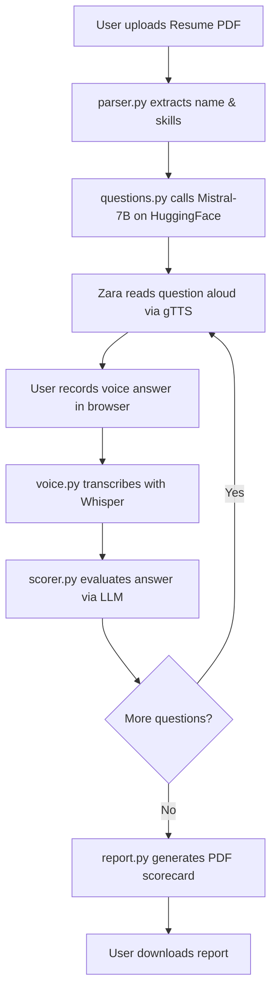

# 🤖 Zara AI — Your AI-Powered Interview Coach

<p align="center">
  
  
  
  
  
</p>

> **Zara AI** is a full-stack, AI-driven mock interview platform. Upload your resume, paste a job description, and let Zara conduct a live voice interview — then instantly receive a detailed PDF performance report.

---

## ✨ Features

| Feature | Description |
|---|---|
| 📄 **Resume Parsing** | Extracts candidate name & skills from PDF using `pdfplumber` + `spaCy` NER |
| 🧠 **AI Question Generation** | Generates tailored interview questions via Mistral-7B on Hugging Face Inference API |
| 🎙️ **Voice Answers** | Records browser microphone audio; transcribes with OpenAI Whisper (offline) |
| 🔊 **Text-to-Speech** | Reads each question aloud using Google TTS (`gTTS`) |
| 📊 **Answer Scoring** | Evaluates every answer with LLM feedback + heuristic fallback |
| 📑 **PDF Report** | Generates a colour-coded interview report with scores, strengths & weaknesses |
| 🔒 **Security Hardened** | 13 bugs fixed: path traversal, file injection, session overflow, race conditions & more |

---

## 🖥️ Demo Flow

```
1. Open http://localhost:5000
2. Upload your resume (PDF)
3. Paste the job description
4. Listen to Zara's questions & answer by voice (or text)
5. Click "Generate Report" → download your PDF scorecard
```

---

## 🗂️ Project Structure

```
ZaraAI/
├── app.py              # Flask application & all API routes
├── config.py           # Central config (API keys, model URLs, timeouts)
├── parser.py           # PDF resume reader + skill/name extractor
├── questions.py        # LLM-powered question & follow-up generator
├── scorer.py           # LLM answer evaluator with heuristic fallback
├── voice.py            # Whisper transcription + gTTS text-to-speech
├── report.py           # fpdf2-based PDF report builder
├── requirements.txt    # Python dependencies
├── templates/
│   └── index.html      # Single-page web UI
├── uploads/            # Temporary resume files (auto-created)
├── reports/            # Generated PDF reports (auto-created)
├── gemma_code_llm/     # Optional: Fine-tune Gemma for custom question generation
│   ├── train_lora.py
│   ├── generate.py
│   ├── api.py
│   └── ...
├── FIXES.md            # Detailed log of all 13 bug fixes applied
└── .env                # Your secrets (never committed)
```

---

## 🚀 Quick Start

### 1. Clone the repository

```bash
git clone https://github.com/srikarpilla/Zara_AI.git
cd Zara_AI
```

### 2. Create & activate a virtual environment

```bash
# Windows
python -m venv venv
venv\Scripts\activate

# macOS / Linux
python3 -m venv venv
source venv/bin/activate
```

### 3. Install dependencies

```bash
pip install -r requirements.txt
python -m spacy download en_core_web_sm
```

### 4. Configure environment variables

Create a `.env` file in the project root:

```env
HF_TOKEN=hf_xxxxxxxxxxxxxxxxxxxx   # Hugging Face API token (free)
SECRET_KEY=your_flask_secret_key   # Any random string
API_TIMEOUT=30                     # Optional: seconds to wait for HF API
```

> **Get a free Hugging Face token:** [huggingface.co/settings/tokens](https://huggingface.co/settings/tokens)

### 5. Run the app

```bash
python app.py
```

Open your browser at **http://localhost:5000** 🎉

---

## ⚙️ Configuration Reference

All settings live in [`config.py`](config.py) and can be overridden via environment variables:

| Variable | Default | Description |
|---|---|---|
| `HF_TOKEN` | *(required)* | Hugging Face API token |
| `SECRET_KEY` | `zara_ai_interview_secret_2025` | Flask session secret |
| `API_TIMEOUT` | `30` | Seconds before HF API fallback |
| `USE_LOCAL_GEMMA` | `true` | Use fine-tuned local Gemma for questions |
| `GEMMA_API_URL` | `http://127.0.0.1:8000/generate` | Local Gemma API endpoint |

---

## 🔌 API Routes

| Method | Endpoint | Description |
|---|---|---|
| `GET` | `/` | Home page |
| `POST` | `/start_interview` | Upload resume, receive first question |
| `POST` | `/submit_answer` | Submit audio file or text answer |
| `POST` | `/get_followup` | Get an AI follow-up question |
| `POST` | `/generate_report` | Score all answers, build PDF |
| `GET` | `/download_report/<filename>` | Download your session's PDF report |
| `GET` | `/api/tts?text=...` | Stream TTS audio for given text |

---

## 🧩 How It Works



---

## 🔒 Security Fixes Applied

This codebase has 13 documented security and reliability fixes. Key highlights:

- **Fix #1** — Path traversal on resume upload (`werkzeug.secure_filename` + UUID prefix)
- **Fix #2** — Arbitrary file reads on report download (session-scoped validation)
- **Fix #3** — Flask session cookie overflow (server-side answer store)
- **Fix #4** — `tempfile.mktemp` race condition + shell injection (`shlex.quote`)
- **Fix #5** — HF API timeout too short (raised 5 s → 30 s)
- **Fix #13** — Non-Latin Unicode corrupted in PDF (DejaVuSans Unicode font support)

> See [`FIXES.md`](FIXES.md) for the complete list with before/after code snippets.

---

## 🤗 Optional: Fine-tuned Gemma Question Generator

The `gemma_code_llm/` sub-project lets you fine-tune a **Gemma 3** model with LoRA to generate highly targeted interview questions locally (no API calls needed).

```bash
cd gemma_code_llm
pip install -r requirements.txt
# See gemma_code_llm/README.md for full instructions
```

When running, set `USE_LOCAL_GEMMA=true` in your `.env` and start the Gemma API server:

```bash
uvicorn gemma_code_llm.api:app --host 127.0.0.1 --port 8000
```

---

## 🛠️ Tech Stack

| Layer | Technology |
|---|---|
| **Backend** | Python 3.10+, Flask |
| **LLM (Cloud)** | Mistral-7B-Instruct via Hugging Face Inference API |
| **LLM (Local)** | Gemma 3 1B/4B fine-tuned with LoRA (optional) |
| **Speech-to-Text** | OpenAI Whisper (base model, runs locally) |
| **Text-to-Speech** | Google TTS (`gTTS`) |
| **PDF Parsing** | `pdfplumber` |
| **NLP / NER** | `spaCy` (`en_core_web_sm`) |
| **PDF Generation** | `fpdf2` |
| **Frontend** | Vanilla HTML / CSS / JavaScript |

---

## 📋 Requirements

```
flask
pdfplumber
spacy
openai-whisper
gTTS
fpdf2
requests
sounddevice
soundfile
numpy
python-dotenv
huggingface_hub
```

Install with: `pip install -r requirements.txt`

---

## 🤝 Contributing

1. Fork the repository
2. Create a feature branch: `git checkout -b feature/my-feature`
3. Commit your changes: `git commit -m "Add my feature"`
4. Push to the branch: `git push origin feature/my-feature`
5. Open a Pull Request

---

## 📄 License

This project is licensed under the **MIT License** — see the [LICENSE](LICENSE) file for details.

---

## 👤 Author

**Srikar Pilla**  
[GitHub](https://github.com/srikarpilla) · Built with ❤️ and AI

---

> *"The best way to prepare for an interview is to practice — Zara AI makes that effortless."*
